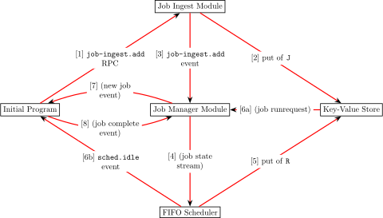
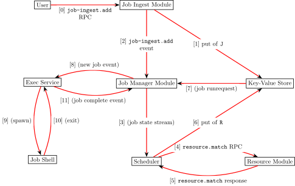

## How to Read

- nodes (i.e., boxes) represent modules or entities
- edges (i.e., red arrows) represent interactions between entities
  - edges whose labels in parentheses represent interfaces that have yet to be fully fleshed out
  - numbers in labels represent the ordering of the interactions for a given job
    - numbers with alpha characters (e.g., 6a and 6b) represent interactions that happen simultaneously

## Simulated Execution
Job execution path under the simulator:

## Acutal Execution
Job execution path under the non-simulated, actual version of Flux:

Note: it has yet to be finalized if the `put of R` will be performed by the scheduler or the resource module.

